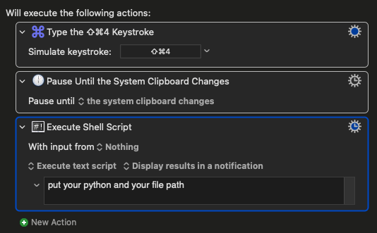

# Mac-Local-Latex-OCR


### 1. Create & Activate Environment

```bash
conda create -n mac-local-latex-ocr python=3.11 -y
conda activate mac-local-latex-ocr
```

### 2. Install Requirements

```bash
# Conda first (faster, fewer conflicts)
conda install --file requirements.txt -c conda-forge -y
# Pip fallback for any leftovers
pip install -r requirements.txt
```

### 3. Get python path and latex.py path

``` Shell
# use which python 
which python

```

### 4. Put you python path and file path to macro


